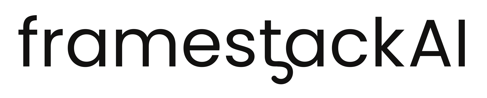

<p align="center">
  
</p>

<p align="center">
  <b>A visual builder for Python where the code is the source of truth.</b><br>
  Your project stays ordinary Python. The graph is a view of it — and a node is green
  only when a real test run entered it.
</p>

<p align="center">
  <a href="#the-convention">The convention</a> ·
  <a href="#quickstart">Quickstart</a> ·
  <a href="#how-it-works">How it works</a> ·
  <a href="#status">Status</a>
</p>

<!-- A screenshot of the workspace belongs here. -->

---

## The difference, in one line

In every other visual builder, a node is green **because it exists**.

Here it is green because a test in your suite entered it and passed.

That is not a feature bolted on top — it is the reason the architecture is what it is. Proving a
node requires the code to be real, runnable and yours, which is exactly what flow-document builders
gave away when they made a JSON canvas the source of truth.

## Why this and not Langflow, Flowise, n8n

|  | Them | Framestack |
| --- | --- | --- |
| Source of truth | a flow document; code is an export | **your Python files** |
| Adding a node | writes an entry into the document | the agent writes an ordinary Python package |
| Editing in the UI | edits the document | rewrites the syntax tree with `libcst`, byte-for-byte everywhere else |
| An edge | drawn by hand on a canvas | **an `import` statement**, read back out of the code |
| A green node means | it exists | **a test entered it and passed** |
| If you delete the builder | the app stops being buildable | the project runs, unchanged |
| Lock-in | the runtime interprets your flow | none — there is no symbol of ours in your project |

## The convention

There are no decorators, no annotations and no kind registry. A node is a **package that exports
what its directory name promises**:

| Directory | Required export | Node |
| --- | --- | --- |
| `rag/` | `search(query, **kw) -> list` and `index(paths) -> None` | RAG |
| `agent/` | `run(message, **kw) -> str` | Agent |
| `api/` | `app` (any ASGI application) | Service |
| `worker/` | `HANDLERS: dict[str, Callable]` | Worker |

The export has to be reachable from the package's `__init__.py`. Nothing else is inspected — an
`agent/` is an Agent whether it is built on LangGraph, Pydantic AI or a thirty-line loop. A directory
that looks like a system but is missing its export is drawn grey, with the reason stated, and is
never guessed at.

Four files at the project root are nodes with no verdict: `.env`, `compose.yaml`, `Dockerfile`,
`mcp.json`. Servers listed in `mcp.json` and containers reported by `docker compose config` are nodes
too — neither can ever be coloured, because nothing in a test run executes a Postgres.

A system may nest others **one level down**, in `agents/`, `rags/`, `workers/` or `apis/`. Colour
aggregates upward: a parent is green when every child and its own code are green, red if any is red,
amber if any is grey.

## How it works

1. **You press a block, or you type.** The palette sends one command to the chat and nothing else —
   `add-system`, `add-tool`, `add-service`, `add-mcp`, `connect`, `repair` or a plain question. A
   coding agent writes ordinary Python that follows the convention; no scaffold ships with the button.
2. **The parser reads the project back.** Nodes come from directories and their `__init__.py`; edges
   come from the `import` statements between them, and from `mcp.json`. No model is involved in
   producing a graph, and the core never imports your code.
3. **You tune it from the canvas.** A system may declare one `settings.py` with a single
   `BaseSettings` class; the node panel edits exactly that class, through `libcst`, so `git diff`
   after a change is one line.
4. **You press Observe.** Your project's own test suite runs under coverage. A node is green because
   a *passing* test executed code inside it — the join of coverage.py's dynamic contexts and pytest's
   JUnit report. What nothing reached stays grey. A run that reached the network is `skipped`, never
   green.

Then `Run` calls one system's export, `Deploy` is `docker compose up`, `Open` hands a file to your
editor, and `Connect` runs an MCP server's own command in the terminal. Everything runs on your
machine.

## The graph is a projection, not an executor

The line that separates this from flow-document builders, written into the UI's behaviour:

- Node position carries no meaning. Moving a node changes nothing in the project.
- There is no connect gesture. Connecting two nodes means writing an `import`.
- There is no run-the-graph button. Execution order lives in Python.
- Every structural change is a code edit, then a re-parse.

## Quickstart

You need **Node 20+**, **Python 3.10+** with [uv](https://docs.astral.sh/uv/), and a
[Rust toolchain](https://rustup.rs) — Tauri will not build without it. The chat needs the
[Claude Code](https://claude.com/claude-code) CLI installed and signed in.

```bash
git clone <this repo> && cd "Framestack AI Builder"
uv sync          # Python workspace
npm install      # front-end and Tauri CLI
npm run dev      # the app
```

Then open [examples/reference/](examples/reference/) — four systems, four file nodes and a suite that
proves each export does something — and press **Observe**.

### Or talk to the core by hand

There are no CLI subcommands. The core is a sidecar speaking NDJSON on stdio, one JSON object per
line:

```bash
echo '{"id":1,"method":"ping"}' | uv run python -m framestack_core
echo '{"id":2,"method":"graph.read","params":{"project":"examples/reference"}}' \
  | uv run python -m framestack_core
```

## Status

Version **0.1.0**, and the rebuild is complete: the read-only graph, Observe, the settings panel, the
chat, `Run`, `Deploy`, the palette, compose services, MCP nodes and `Connect`. 284 tests and one gate
(`npm run check`) that CI runs and nothing else.

**Honest caveats:** the chat half needs Claude Code installed and signed in. `Deploy` needs Docker.
Building the desktop app needs a Rust toolchain, and `.app`/`.dmg` can only be built on macOS. There
is one reference project, and it is the one every acceptance criterion is stated about.

**Deliberately out of scope:** any granularity below a package, more than one level of nesting, any
kind beyond the four, a gallery of templates we ship, multi-project workspaces, cloud sync, executing
the graph itself.

## Contributing

The architecture, the protocol and the rules a change has to hold to are in
[CLAUDE.md](CLAUDE.md). The invariants that matter, and a change that breaks one is reverted:

1. **Code is the only source of truth.** No manifest, no graph file, no state that exists only in
   the UI.
2. **Recognition is deterministic.** Directory structure and import statements, never a model.
3. **Green is earned by a run.** A check that could not run reports *skipped*, never green.
4. **Observe is reproducible.** Three runs on an unchanged project produce an identical verdict set.
5. **Every edit goes through `libcst`.** Everything the edit was not about stays byte-identical.
6. **If you delete Framestack, the project still runs.**

## License

MIT — see [LICENSE](LICENSE).
